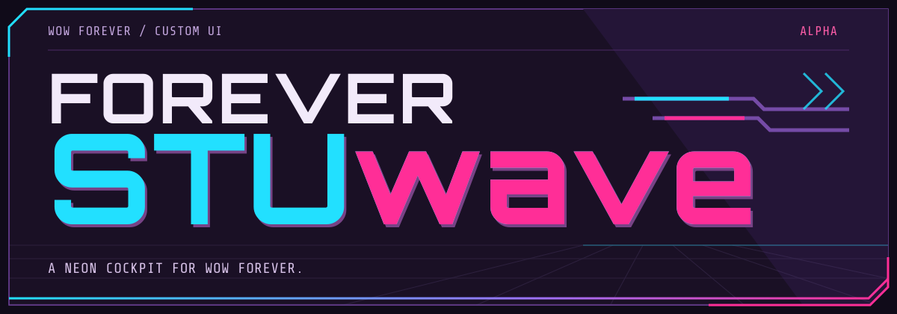

<p align="center">
  
</p>

<p align="center">
  A custom UI for WoW Forever.<br>
  <strong>Beta · Interface 16001 · 16:9</strong>
</p>

<p align="center">
  <a href="#install">Install</a> ·
  <a href="#update">Update</a> ·
  <a href="#help-shape-it">Help shape it</a> ·
  <a href="docs/DEVELOPMENT.md">Development</a>
</p>

<p align="center">
  <a href="https://github.com/ironmoose/forever-stuwave/releases/download/v0.1.0-alpha.1/ForeverSTUwave-0.1.0-alpha.1.zip">
    
  </a>
</p>

## Install

1. **Close WoW.**
2. [Download the addon ZIP](https://github.com/ironmoose/forever-stuwave/releases/download/v0.1.0-alpha.1/ForeverSTUwave-0.1.0-alpha.1.zip) and extract it.
3. Put its `forever-stuwave/` folder into `_classic_beta_/Interface/AddOns/`. Keep its name unchanged.
4. Start WoW and enable **Forever STUwave** in the AddOns menu.

> **Existing install?** Use the [deployment script](docs/DEVELOPMENT.md#deploying-a-development-build) to migrate settings and retire the old copy.

<details>
<summary>Install from Git</summary>

Clone outside your game folder:

```sh
git clone https://github.com/ironmoose/forever-stuwave.git
```

Copy the inner `forever-stuwave/` folder into `Interface/AddOns/`, or use the [deployment script](docs/DEVELOPMENT.md#deploying-a-development-build).

</details>

## Update

1. **Close WoW** and download the new addon ZIP from [Releases](https://github.com/ironmoose/forever-stuwave/releases).
2. Replace the installed `forever-stuwave/` folder with the one from the ZIP.
3. **Fully restart WoW.**

For a Git install, run `git pull --ff-only` in your checkout and repeat the copy or deployment.

## Help shape it

### Report a bug

1. Describe the problem in game:

   ```text
   /fsbug what went wrong
   ```

2. Copy the report that opens. It includes your **class, level, addon settings, and recent errors**.
3. Review it, then paste it into a [new bug report](https://github.com/ironmoose/forever-stuwave/issues/new). Add a screenshot if the problem is visual.

### Suggest an improvement

[Share your idea](https://github.com/ironmoose/forever-stuwave/issues/new). Tell us what you'd like to change and why.

---

[Testing guide](docs/TESTING.md) · [Development](docs/DEVELOPMENT.md) · [MIT license](LICENSE) · [Third party notices](docs/THIRD_PARTY_NOTICES.md)
